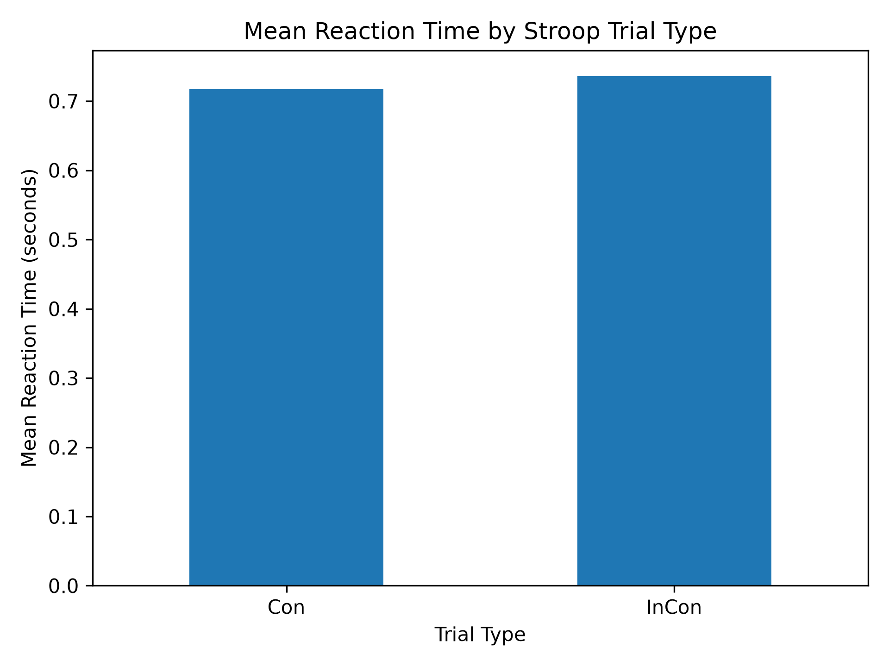
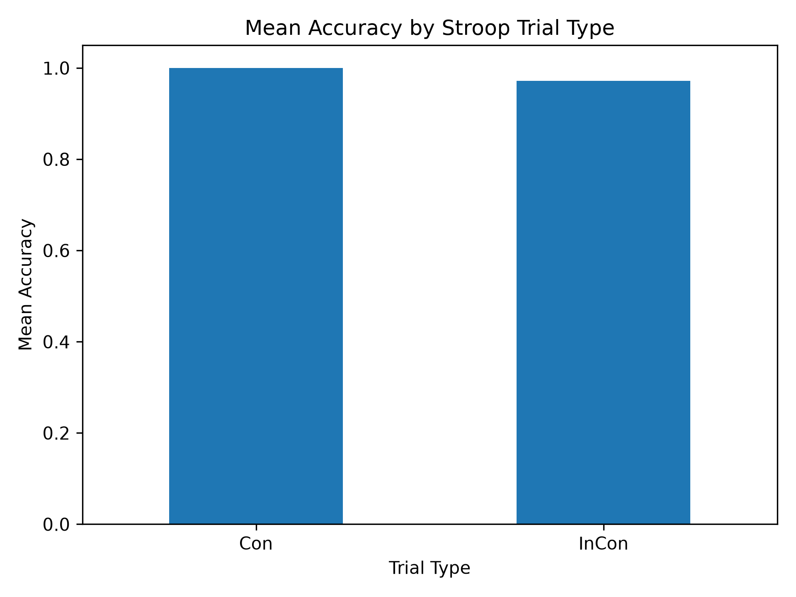

# cognitive-control-reaction-time-analysis
Behavioral analysis of cognitive-control task data using Python , focusing on reaction time, accuracy , and experimental conditions.

## Project Overview

This project analyzes behavioral data from a Stroop cognitive-control task to examine how cognitive conflict affects reaction time and response accuracy.

The analysis compares congruent and incongruent trials to investigate the Stroop interference effect.

## Research Question

Do incongruent Stroop trials produce slower reaction times and lower response accuracy compared with congruent trials?

## Dataset

This project uses behavioral data from the Dual Mechanisms of Cognitive Control (DMCC55B) dataset, available through OpenNeuro (dataset ds003465).

The analysis uses Stroop task data containing trial type, reaction time, and response accuracy.

The dataset was created by researchers at Washington University in St. Louis and is associated with a peer-reviewed scientific publication.

## Methods

The behavioral data were analyzed using Python with pandas and matplotlib.

The analysis included:

- Calculating the number of congruent and incongruent trials
- Calculating mean reaction time for each trial type
- Calculating mean response accuracy for each trial type
- Calculating the Stroop interference effect
- Visualizing reaction time and accuracy across trial types

## Results

### Reaction Time

Mean reaction time was:

- Congruent trials: 0.717 seconds
- Incongruent trials: 0.736 seconds

The Stroop interference effect was approximately 18.97 ms, with slower responses during incongruent trials.

### Accuracy

Mean response accuracy was:

- Congruent trials: 100%
- Incongruent trials: 97.2%

Accuracy was slightly lower during incongruent trials.

